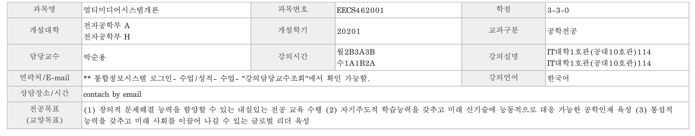
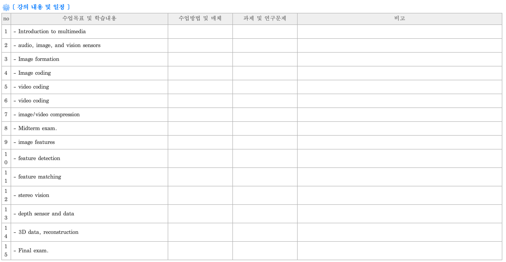

# 2020년도 1학기 : 멀티미디어시스템개론 (EECS462001)

본 자료는 경북대학교 전자공학부 수업 중 2020년도 1학기에 진행한 ‘박순용’ 교수님의 ‘멀티미디어시스템개론’ 과목에 대한 정리이다.

상단의 폴더를 클릭하며 과제에 대한 설명과 해결 과정을 확인할 수 있다.

아래의 표는 이 과목이 어떤 식으로 진행이 되었는지에 대한 강의계획서이다.

아래 그림은 실제 실험과정을 촬영한 이미지 샘플이며 실험과정의 세부 절차가 번호로 표기되어 있다. 이미지 하단에 각 번호에 대응되는 상세 절차가 구체적으로 기술되어 있다. 

